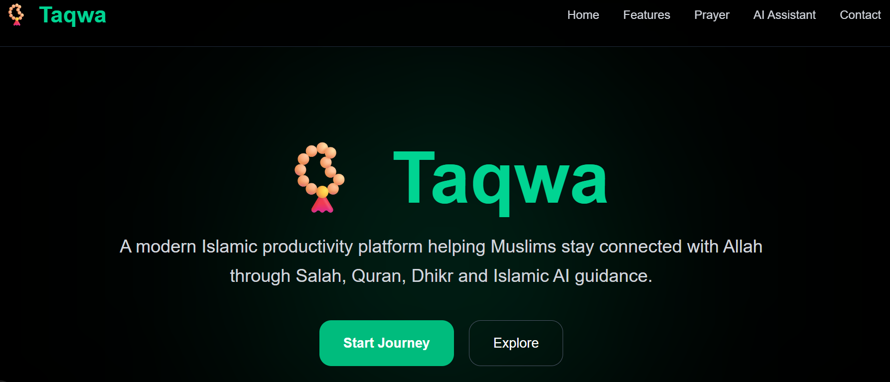
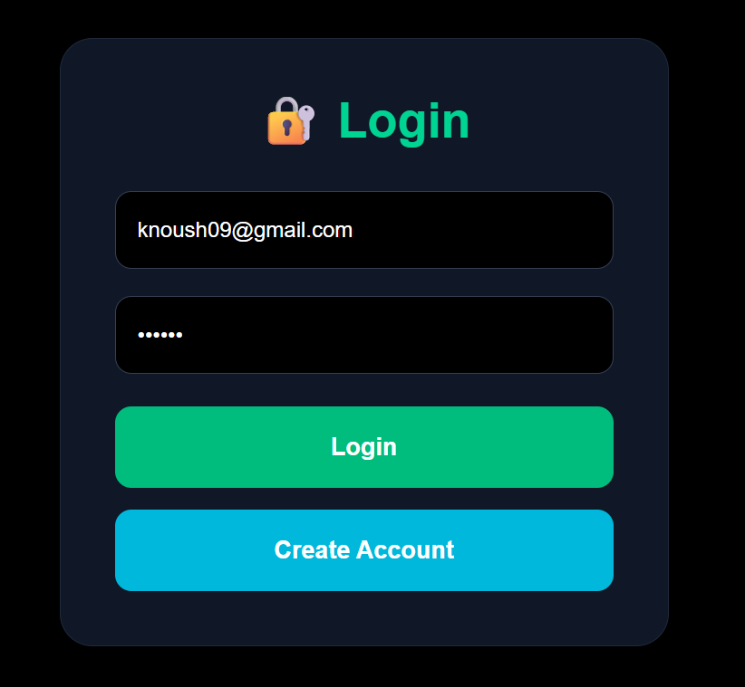
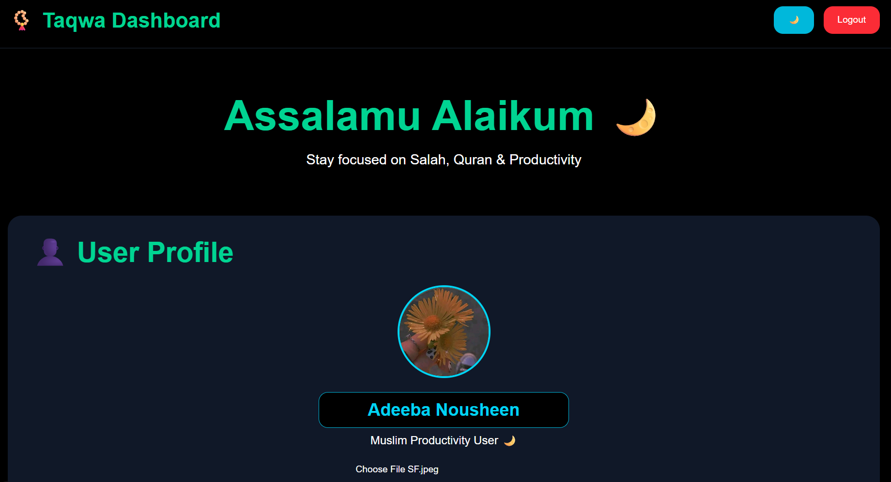
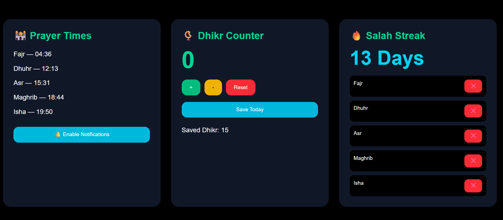
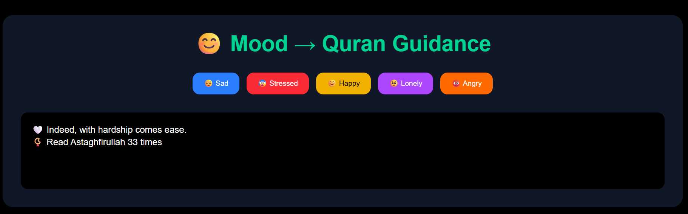
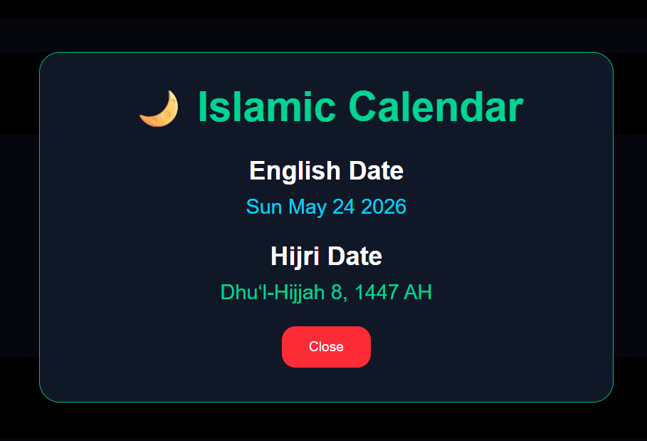
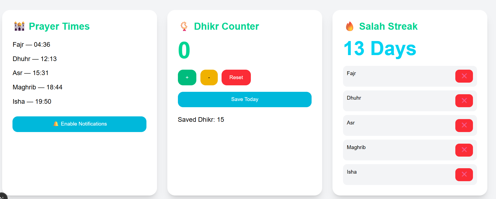

# 📿 Taqwa — Islamic Productivity Web App

Taqwa is a modern Islamic productivity platform built with Next.js and Firebase.  
It helps Muslims stay connected with Allah through Salah, Quran, Dhikr, Islamic AI guidance and productivity tools 🌙

---

# 🌟 Features

✨ Firebase Authentication  
✨ Islamic AI Assistant  
✨ Real-time Prayer Times  
✨ Dhikr Counter  
✨ Salah Streak Tracker  
✨ Quran Audio Player  
✨ Islamic Calendar  
✨ Mood-based Islamic Guidance  
✨ Dark / Light Mode  
✨ User Profile Upload  

---

# 🖼️ Screenshots

---

## 🏠 Home Page



---

## 🔐 Login Page



---

## 👤 User Profile



---

## 🕌 Prayer Times + Dhikr + Salah Streak



---

## 🤖 Islamic AI Assistant


---

## 📖 Full Quran Reader


---

## 😊 Mood → Quran Guidance



---

## 🌙 Islamic Calendar



---

## ☀️ Dark / Light Mode



---

# ✨ Features Explained

## 🔐 Firebase Authentication

Taqwa uses Firebase Authentication for secure login and signup functionality.

### Features:
- User Registration
- Secure Login
- Logout System
- Firebase Authentication Integration
- Protected Dashboard Access

Users can create accounts and securely access their personalized Islamic dashboard.

---

## 🕌 Real-Time Prayer Times

The application fetches real-time Salah timings using the Aladhan Prayer API.

### Included Prayer Timings:
- Fajr
- Dhuhr
- Asr
- Maghrib
- Isha

### Additional Features:
- Clean UI cards
- Real-time timings
- Prayer notification support
- Islamic-focused design

This helps users stay connected with Salah throughout the day.

---

## 📿 Dhikr Counter

The Dhikr Counter helps users perform daily remembrance of Allah.

### Features:
- Increment Counter
- Decrement Counter
- Reset Counter
- Save Daily Dhikr
- localStorage Data Saving

Users can track tasbeeh and save their daily dhikr progress.

---

## 🔥 Salah Streak Tracker

This feature motivates users to maintain consistency in prayers.

### Features:
- Daily prayer tracking
- Completion buttons for each Salah
- Automatic streak counting
- Motivation system
- Prayer consistency monitoring

When all prayers are completed, the streak automatically increases.

---

## 🤖 Islamic AI Assistant

The Islamic AI Assistant provides answers to basic Islamic questions.

### Example Questions:
- What are the 5 pillars of Islam?
- What is Salah?
- What is Quran?
- Who is Allah?
- Who is Prophet Muhammad ﷺ?

### Features:
- Instant responses
- Islamic educational guidance
- Beginner-friendly interface
- Smart keyword-based responses

The assistant is designed to provide simple and meaningful Islamic guidance.

---

## 📖 Full Quran Reader

The Quran Reader allows users to listen to beautiful Quran recitations directly inside the app.

### Included Surahs:
- Surah Al-Fatiha
- Surah Yaseen
- Surah Ar-Rahman
- Surah Al-Mulk
- Surah Al-Ikhlas
- Surah Al-Falaq
- Surah An-Nas

### Features:
- Audio playback
- Responsive audio player
- Beautiful Islamic UI
- Easy listening experience

---

## 😊 Mood → Quran Guidance

This feature provides Islamic motivation and reminders based on user emotions.

### Supported Moods:
- Sad
- Happy
- Lonely
- Angry
- Stressed

### Guidance Includes:
- Quran reminders
- Islamic motivation
- Dhikr suggestions
- Positive emotional support

This helps users emotionally reconnect with Islam and spirituality.

---

## 🌙 Islamic Calendar

The Islamic Calendar section displays both Gregorian and Hijri dates.

### Features:
- English Date
- Hijri Date
- Popup Calendar Modal
- Beautiful Islamic Design

Users can easily track important Islamic dates.

---

## ☀️ Dark / Light Mode

Users can switch between Dark Mode and Light Mode for a better experience.

### Features:
- Smooth theme switching
- Modern UI design
- Comfortable viewing experience
- Responsive styling

The application maintains a clean modern Islamic aesthetic in both themes.

---

# 🛠️ Tech Stack

| Technology | Purpose |
|---|---|
| Next.js | Frontend Framework |
| React.js | UI Development |
| Firebase | Authentication |
| Tailwind CSS | Styling |
| Aladhan API | Prayer Timings API |

---

# 🚀 Installation

Clone repository:

```bash
git clone https://github.com/YOUR_USERNAME/taqwa.git
```

Move into project:

```bash
cd taqwa
```

Install dependencies:

```bash
npm install
```

Run project:

```bash
npm run dev
```

Open:

```bash
http://localhost:3000
```

---

# 🔐 Firebase Setup

Create Firebase project and add config inside:

```bash
firebase.js
```

Example:

```javascript
import { initializeApp } from "firebase/app";

const firebaseConfig = {
  apiKey: "YOUR_API_KEY",
  authDomain: "YOUR_DOMAIN",
  projectId: "YOUR_PROJECT_ID",
};

const app = initializeApp(firebaseConfig);

export default app;
```

---

# 📂 Project Structure

```bash
app/
 ├── dashboard/
 │    └── page.jsx
 ├── login.jsx
 ├── page.tsx
 ├── globals.css
 └── layout.tsx
```

---

# 🌍 Future Improvements

- Real AI integration
- Quran translations
- Hadith section
- Ramadan Mode
- Daily Islamic quotes
- Cloud database storage
- Multi-language support

---

# 👩‍💻 Developer

### Adeeba Nousheen 🌙

Built with faith, focus and modern technology 🤍

---

# 🌙 Islamic Quote

> “Indeed, with hardship comes ease.”
> — Quran 94:6

---
